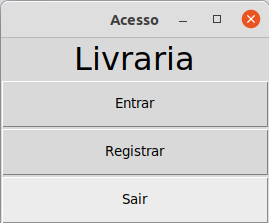

# livraria
Um aplicativo de balcão de livraria, implementado com orientação a objetos. Salvando informações como arquivo de texto.

## Menu



## Como excutar

```bash
$ python3 main.py
```

### Dependencies

- [tkinter](https://docs.python.org/3/library/tk.html)

```bash
$ apt install python3-tk